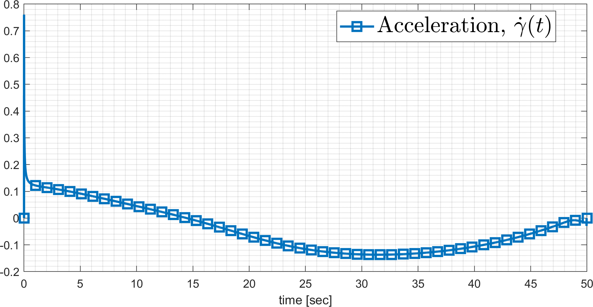

## Parameters

- $V = 200$m/s

- $J = \sum_{i=1}^{3} w_i J_i$

  - $J_1 = \int_{t_0}^{t_f} \dot{\gamma}(t) dt$

  - $J_2 = \max(\|\sigma(t)\|)$

  - $J_3 = \max(\|\dot{\gamma}(t)\|)$

- $[t_0,t_f] = [0,50]$ sec (fixed time)

## Determine proper Bezier degree

```
 ======= Optimization Result ======= 
 weight for integral_a^2dt      : 1
 weight for Maximum Lookangle   : 0
 weight for Maximum Acceleration: 0

 ------- Bezier Coefficients -------
 Bezier Degree: 4
 Initial: 5000.000   2500.000   5000.000   2500.000    0.000   
 Optimal: 5000.000   2500.000   5004.145   2500.000    0.000   

 ------- Optimal Solution ------- 
 Maximum Accelerations(deg/s): 3.463
 Maximum Look angle(deg): 83.642 
 integral_a^2dt: 0.780


 ------- Bezier Coefficients -------
 Bezier Degree: 5
 Initial: 5000.000   3000.000   6000.000   4000.000   2000.000    0.000   
 Optimal: 5000.000   3000.000   3113.308   4003.606   2000.000    0.000   

 ------- Optimal Solution ------- 
 Maximum Accelerations(deg/s): 2.906
 Maximum Look angle(deg): 82.222 
 integral_a^2dt: 0.734


 ------- Bezier Coefficients -------
 Bezier Degree: 6
 Initial: 5000.000   3333.333   6666.667   5000.000   3333.333   1666.667    0.000   
 Optimal: 5000.000   3333.333   1747.239   5244.020   3327.132   1666.667    0.000   

 ------- Optimal Solution ------- 
 Maximum Accelerations(deg/s): 0.708
 Maximum Look angle(deg): 92.853 
 integral_a^2dt: 0.464
 
 
  ------- Bezier Coefficients -------
 Bezier Degree: 7
 Initial: 5000.000   3571.429   7142.857   5714.286   4285.714   2857.143   1428.571    0.000   
 Optimal: 5000.000   3571.429   2193.216   4844.184   4332.510   2856.002   1428.571    0.000   

 ------- Optimal Solution ------- 
 Maximum Accelerations(deg/s): 0.669
 Maximum Look angle(deg): 95.365 
 integral_a^2dt: 0.455


 ------- Bezier Coefficients -------
 Bezier Degree: 8
 Initial: 5000.000   3750.000   7500.000   6250.000   5000.000   3750.000   2500.000   1250.000    0.000   
 Optimal: 5000.000   3750.000   2548.127   2607.332   5289.845   3737.221   2500.029   1250.000    0.000   

 ------- Optimal Solution ------- 
 Maximum Accelerations(deg/s): 0.742
 Maximum Look angle(deg): 98.555 
 integral_a^2dt: 0.443


 ------- Bezier Coefficients -------
 Bezier Degree: 9
 Initial: 5000.000   3888.889   7777.778   6666.667   5555.556   4444.444   3333.333   2222.222   1111.111    0.000   
 Optimal: 5000.000   3888.889   2817.233   2520.571   4264.997   4554.204   3328.298   2222.235   1111.111    0.000   

 ------- Optimal Solution ------- 
 Maximum Accelerations(deg/s): 0.761
 Maximum Look angle(deg): 99.026 
 integral_a^2dt: 0.443

```
We use $n=8$ because the optimal solution value (0.443) is similar to that of the case $n=9$.

## 1. int_a^2dt

$ J = \int_{t_0}^{t_f}\dot{\gamma}(t)^2dt$

$a(t) = V\dot{\gamma}(t)$

```
 ======= Optimization Result ======= 
 weight for integral_a^2dt      : 1
 weight for Maximum Lookangle   : 0
 weight for Maximum Acceleration: 0

 ------- Bezier Coefficients -------
 Bezier Degree: 8
 Initial: 5000.000   3750.000   7500.000   6250.000   5000.000   3750.000   2500.000   1250.000    0.000   
 Optimal: 5000.000   3750.000   2548.127   2607.332   5289.845   3737.221   2500.029   1250.000    0.000   

 ------- Optimal Solution ------- 
 Maximum Accelerations(deg/s): 0.742
 Maximum Look angle(deg): 98.555 
 integral_a^2dt: 0.443
```




## 2. max(abs(acc))

```
 ======= Optimization Result ======= 
 weight for integral_a^2dt      : 0
 weight for Maximum Lookangle   : 0
 weight for Maximum Acceleration: 1

 ------- Bezier Coefficients -------
 Bezier Degree: 8
 Initial: 5000.000   3750.000   7500.000   6250.000   5000.000   3750.000   2500.000   1250.000    0.000   
 Optimal: 5000.000   3750.000   2498.927   2909.014   2499.989   2087.552   2504.322   1250.000    0.000   

 ------- Optimal Solution ------- 
 Maximum Accelerations(deg/s): 0.414
 Maximum Look angle(deg): 78.673 
 integral_a^2dt: 0.827
>> 
```


## 3. max(abs(look_angle))

```
 ======= Optimization Result ======= 
 weight for integral_a^2dt      : 0
 weight for Maximum Lookangle   : 1
 weight for Maximum Acceleration: 0

 ------- Bezier Coefficients -------
 Bezier Degree: 8
 Initial: 5000.000   3750.000   7500.000   6250.000   5000.000   3750.000   2500.000   1250.000    0.000   
 Optimal: 5000.000   3750.000   4237.004   2587.002   2491.137   2455.583   717.961   1250.000    0.000   

 ------- Optimal Solution ------- 
 Maximum Accelerations(deg/s): 13.398
 Maximum Look angle(deg): 63.621 
 integral_a^2dt: 7.221
>> 
```


